# Installing the app

This guide assumes that you already have an account with Matomo and have enabled tracking for at least one website. 
If not, please [refer to guidelines](https://matomo.org/) to set up Matomo Analytics first. Alternatively, you may
install Matomo on-premise.

1. In the "Manage Measurables" dashboard click the "Add a new measurable" button.
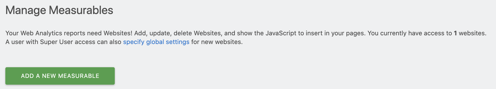 

2. Select whether you would like to add analytics to a public website or intranet.


3. Fill out the form and click "Save".
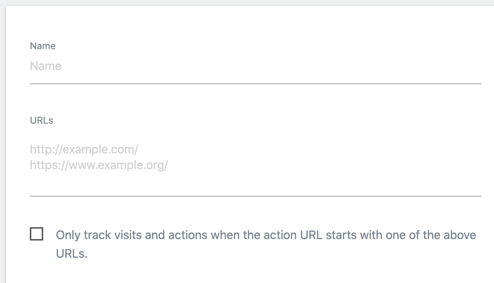

4. After the measurable has been created, click "View tracking code".
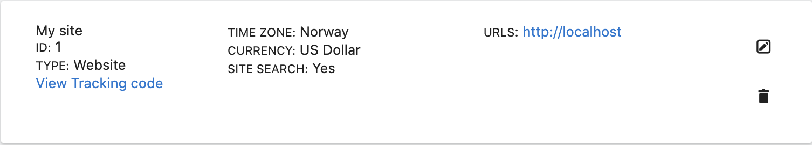

5. Save the urls and site id for later.
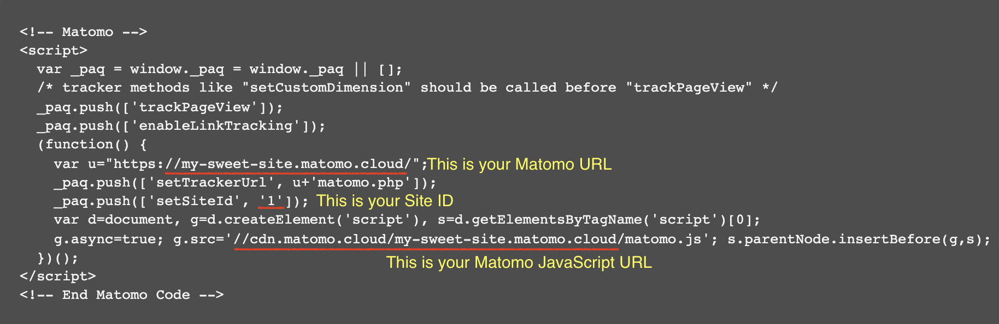

6. Install the Matomo app in Enonic XP, either from Market or build it from this repository.
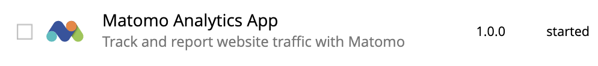

7. Add the app to the site you wish to add analytics to by clicking "edit" on the site and simply adding it.
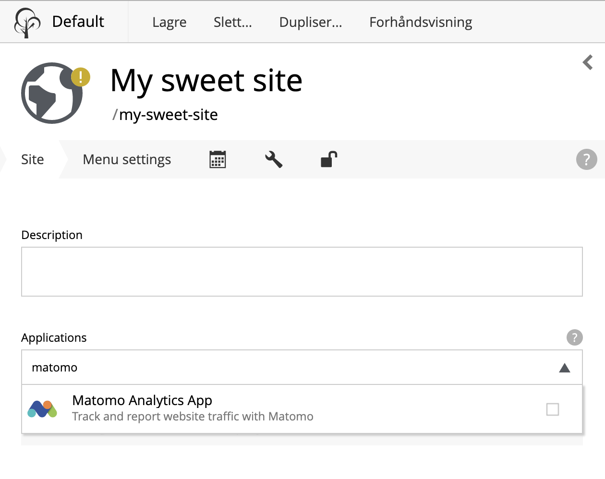

8. Click the pencil icon on the app. Enter the Matomo URL, Matomo JavaScript URL and Site ID from the step 5. If you wish to enable tracking,
also check the box.
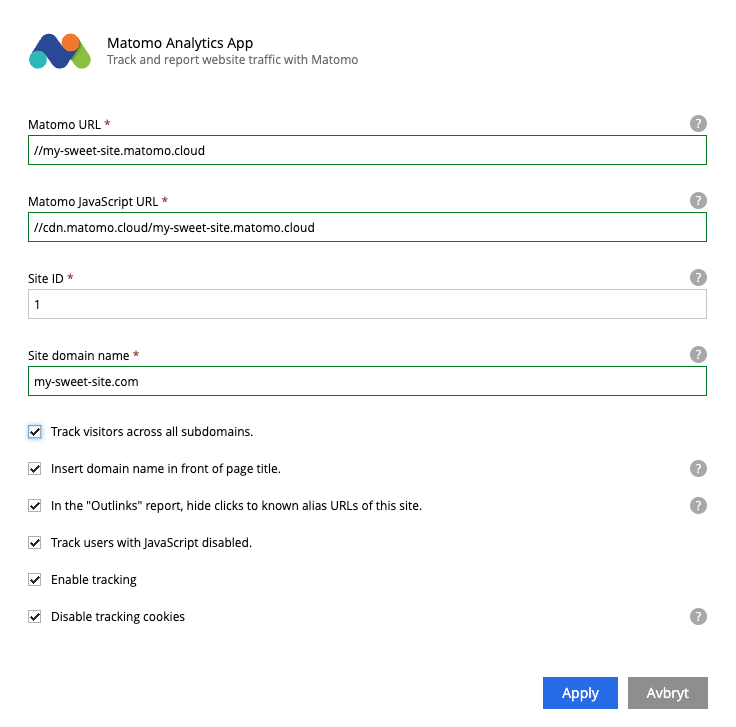

9. In version 1.5 an override field has been added. This is due to matomo cloud hosting has a default cache for 8 days, and sometimes it is necessary to force an override. The date will be added to the url, enticing the browser to detect that the file is new. 

10. Finally, publish the site.

That’s it, you’re done!

You should now be able to see user behavior in Matomo.

# Matomo Tag Manager
If you want to use [Matomo Tag Manager](https://matomo.org/guide/tag-manager/) you must first create a container. Follow the instructions on Matomo's website.

You will find the Container ID on the Tag Manager / Manage Containers page.
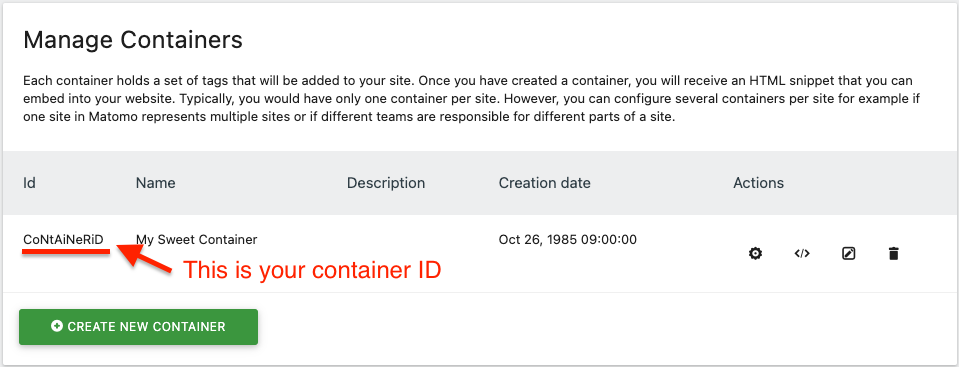

Enter the Container ID into the app config in Enonic XP, then publish the site and you're done!
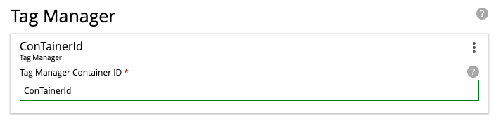

# Installing and using the widget

1. Create a config file called `no.bouvet.app.matomo.cfg` in the config folder of your XP installation

2. Add your matomo-token to this file. No quotes
```
matomo.token = token
```

3. Build and deploy the app

4. Open the context panel for the site on the right-hand side of the Content Studio, and select content.

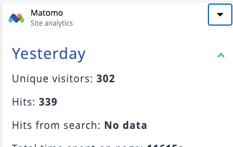

# Content Security Policy (CSP)

_If your site doesn't have a CSP, you should definitively have one._

If you have a CSP, you need to insert the following entries into it for the app to work properly:
- `script-src: 'self', [your matomo server url]/matomo.js`
- `connect-src: Matomo server tracker Url (e.g. [your matomo server url]/matomo.php`

As an example; if our site has the urls from step 8, above, the CSP rules pertaining to Matomo will look like this:
- `script-src: 'self', my-sweet-site.matomo.cloud/matomo.js`
- `connect-src: Matomo server tracker Url (e.g. my-sweet-site.matomo.cloud/matomo.php`

# Tracking cookies
By default, the Matomo tracking code will store tracking cookies on the user's device whether the user has consented or not.

If you wish to deactivate tracking cookies, you have three options:

## Never use tracking cookies
Simply tick the box "Disable tracking cookies". Matomo analytics will not set any cookies on the user's device.

## Roll your own 
Tick the box "Disable tracking cookies". Matomo analytics will no longer set tracking cookies by default.

You may implement functionality on your site allowing users to consent to cookies.

If the user consents, run `window._paq.push(["rememberCookieConsentGiven"])` once. Matomo analytics will remember that the user has consented.

Later, if the user revokes consent, run `window._paq.push(["forgetCookieConsentGiven"])` once. Matomo analytics will remember that the user has revoked consent.

## Cookie Panel app
If you use the Cookie Panel app (coming soon to Enonic Market), you can use this to toggle user consent to cookies.

Enter the following values:
- Cookie name: `no-bouvet-app-matomo_disabled`
- Cookie value accepted: `false`
- Cookie value rejected: `true`

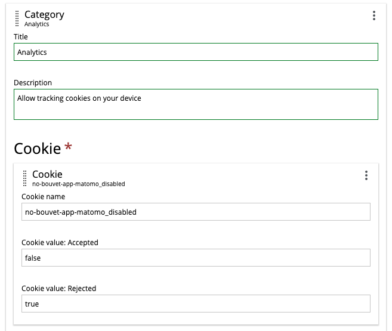

The Matomo analytics app will check whether the Cookie Panel app is installed and add functions to the window object if it is. This will allow the Cookie Panel app to toggle user consent for storing tracking cookies.
